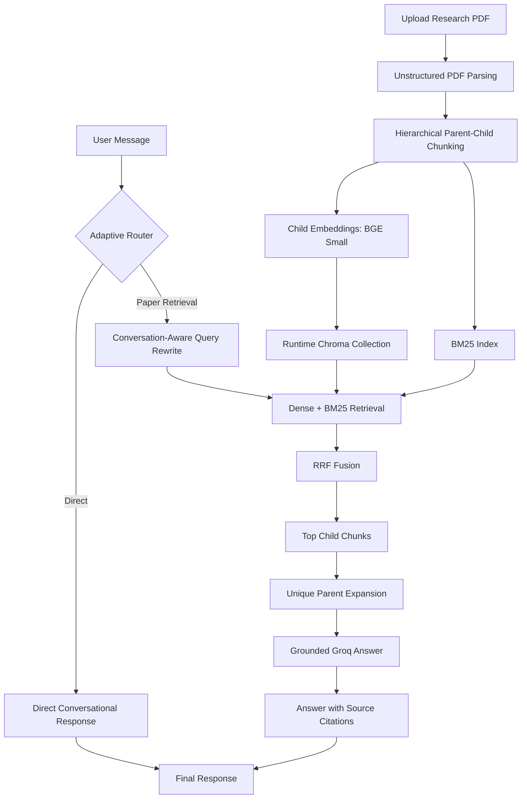

# Adaptive Research Paper RAG Analyzer

A Streamlit application for uploading a research paper and asking grounded, conversational questions with source citations. The system uses adaptive query routing to decide whether a message requires document retrieval or a direct conversational response.

## Key Features

- Adaptive routing between direct conversation and paper retrieval
- Hybrid rule-based and LLM-based query classification
- Conversation-aware query rewriting for vague follow-up questions
- Dense retrieval with BGE embeddings and Chroma
- Sparse retrieval with BM25
- Reciprocal Rank Fusion (RRF) for hybrid retrieval
- Hierarchical parent-child chunking
- Parent-context expansion for answer generation
- Grounded answers with section and page citations
- LangGraph conversation state with runtime memory
- Streamlit interface with visible routing decisions
- Golden-set retrieval evaluation pipeline

## Architecture



## Adaptive Graph Workflow

```text
START
  |
  v
route_question
  |-- direct ------> direct_response ----------------------> END
  |
  `-- retrieval ---> rewrite_question
                           |
                           v
                    retrieve_documents
                           |
                           v
                      build_context
                           |
                           v
                     generate_answer ----------------------> END
```

The router uses deterministic rules for obvious conversational messages and Groq for ambiguous messages. Paper-related follow-ups are classified using recent conversation history. If routing fails, the graph safely defaults to retrieval.

## Technology Stack

| Component | Technology |
|---|---|
| User interface | Streamlit |
| Workflow orchestration | LangGraph |
| LLM chains and retrievers | LangChain |
| Language model | Groq (`openai/gpt-oss-120b` by default) |
| Embeddings | `BAAI/bge-small-en-v1.5` |
| Vector store | Chroma |
| Sparse retrieval | BM25 |
| Fusion | Reciprocal Rank Fusion |
| PDF parsing | Unstructured |
| Runtime memory | LangGraph `InMemorySaver` |

## Retrieval Configuration

```text
Parent chunk size:       1500 characters
Parent overlap:           150 characters
Child chunk size:         350 characters
Child overlap:             50 characters
Dense candidates:          10
BM25 candidates:           10
Final child candidates:    10
Maximum parent contexts:    5
```

## Project Structure

```text
research-paper-rag-analyzer/
|-- streamlit_app.py
|-- requirements.txt
|-- .env.example
|-- src/
|   |-- config.py
|   |-- pdf_parser.py
|   |-- hierarchical_chunker.py
|   |-- hybrid_retriever.py
|   |-- context_builder.py
|   |-- rag_chain.py
|   |-- conversation.py
|   `-- ingest.py
|-- evaluation/
|   |-- evaluate_retrieval.py
|   |-- map_ground_truth.py
|   `-- retrieval_summary.json
`-- storage/
```

## Local Installation

### 1. Create and activate a virtual environment

```powershell
python -m venv .venv
.\.venv\Scripts\Activate.ps1
```

### 2. Install dependencies

```powershell
pip install -r requirements.txt
```

### 3. Configure the Groq API key

Copy `.env.example` to `.env`:

```powershell
Copy-Item .env.example .env
```

Add your key:

```env
GROQ_API_KEY=your_groq_api_key
GROQ_MODEL=openai/gpt-oss-120b
```

### 4. Run the application

```powershell
python -m streamlit run streamlit_app.py
```

Open `http://localhost:8501` if the browser does not open automatically.

## Example Routing Behavior

| User message | Selected route |
|---|---|
| `Hi, how are you?` | Direct response |
| `What can you do?` | Direct response |
| `Who are the authors of this paper?` | Paper retrieval |
| `What methodology was used?` | Paper retrieval |
| `Why is the second method useful?` | Paper retrieval using conversation history |

The Streamlit interface displays the selected route below every assistant response.

## Retrieval Evaluation

The repository includes a 14-question golden dataset and scripts for evaluating child-level and parent-level retrieval.

The saved baseline used six final child chunks and three parent contexts:

| Metric | Baseline result |
|---|---:|
| Hit@6 | 0.6429 |
| Recall@6 | 0.6429 |
| MRR | 0.4524 |
| Parent Hit@3 | 0.6429 |
| Average retrieval latency | 0.0712 seconds |

The current application uses a broader top-10 child and top-5 parent cutoff to improve recall for vague questions. The evaluation should be rerun before reporting metrics for the current configuration.

## Streamlit Cloud Deployment

1. Push the project to a GitHub repository.
2. Create a Streamlit Community Cloud application.
3. Select `streamlit_app.py` as the main file.
4. Add the following secret in the Streamlit dashboard:

```toml
GROQ_API_KEY = "your_groq_api_key"
```

The hosted application uses runtime-only storage. Uploaded documents, vector collections and conversations may disappear when the application restarts.

## Current Scope

- One research paper is active at a time.
- The hosted interface accepts text-based PDFs up to 20 MB.
- Conversation memory is limited to the current runtime session.
- No authentication or persistent user database is included.
- Answers are restricted to retrieved paper context and may fail when relevant evidence is not retrieved.

## What This Project Demonstrates

- Designing a graph-based adaptive RAG workflow
- Combining deterministic and LLM-based routing
- Building hybrid dense and sparse retrieval
- Implementing hierarchical retrieval and context expansion
- Managing stateful conversations with LangGraph
- Evaluating retrieval quality with a mapped golden dataset
- Building and deploying an end-to-end AI application
